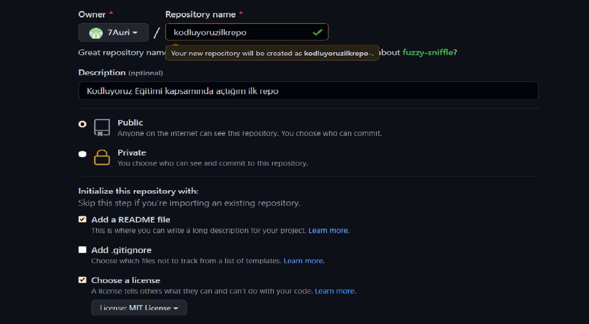

    
# Kodluyoruz Ilk Repo

**Bu repo [Kodluyoruz](https://www.kodluyoruz.org/) Front-End Eğitiminde oluşturduğumuz ilk repo.İçerisinde bir adet README dosyası, bir adet de index.html barındırıyor.**



## Installation

**Öncelikle projeyi clonelayın.**(https://github.com/7Auri/kodluyoruzilkrepo.git)


```


    git clone https://github.com/7Auri/kodluyoruzilkrepo.git

```

## Usage

**Projeyi cloneladıktan sonra Visual Studio Code programında açınız.**

 **Linux için:**

 ```


   cd kodluyoruzilkrepo
   code .

   ```

## Contributing

**Pull requestler kabul edilir. Büyük değişiklikler için, lütfen önce neyi değiştirmek istediğinizi tartışmak için konu açınız.**

## License 

[MIT](https://github.com/7Auri/kodluyoruzilkrepo/blob/main/LICENSE)